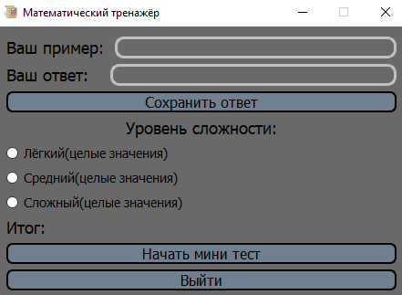
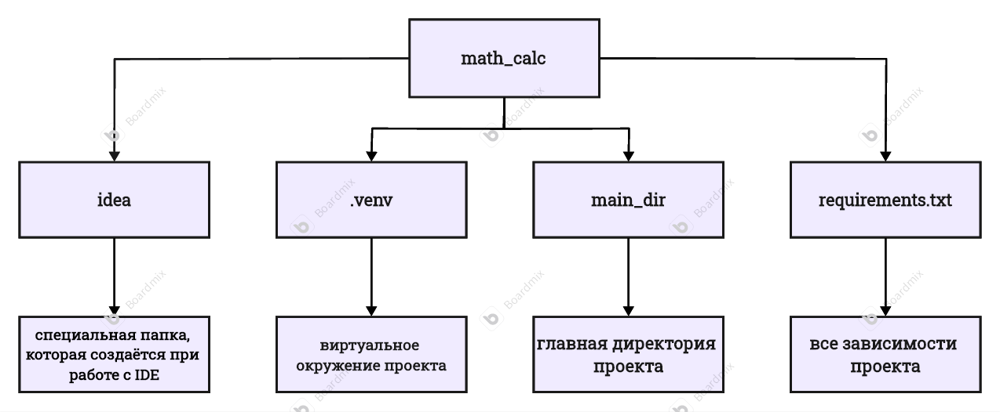

# Простой тренажёр математических примеров на python

## Описание:

Представляем вашему вниманию интуитивно понятный и простой в освоении инструмент для тренировки математических навыков. Суть программы заключается в решении арифметических задач. Для удобства пользователей предусмотрено три уровня сложности: базовый, продвинутый и экспертный. Данное приложение адресовано тем, кто испытывает трудности с устным счетом, в первую очередь - ученикам младших классов.

* **Главный интерфейс тренажёра:**

   

# Установка:
1) Установите проект на ваш пк и перейдите в папку password_message. Создайте клон проекта и перейдите в него:
 
   `git clone https://github.com/max32323/simple_math_coach.git`

   `cd simple_math_coach`

2) Через любой удобный вам редактор кода создайте 
виртуальное окружения для проекта:
   
    `python -m venv venv`

    `venv\Scripts\activate`

3) Установите все зависимости проекта:

    `pip install -r requirements.txt`

## Запуск: 

1) Запустите **math_test.py**. После запуска вы должны увидеть главное меню, которое было показано сверху
2) Выберете уровень примеров и нажмите **"Начать мини тест"**

## Схема проекта:

* _Схема всего проекта:_

## Преимущества:

* Простой и понятный для пользователей интерфейс
* Разные типы примеров для решения
* Разные уровни для генерации примеров
* Простая система оценивания(баллы)

## Назвачение виджетов(кнопок):

1) **"Начать мини тест"**: виджет, который начинает генерацию примеров определённого уровня.
2) **"Сохранить ответ"**: кнопка, сохраняющая ваш вариант ответа.
3) **"Выход"**: виджет, закрывающий программу.

## Лицензия
Этот проект распространяется под лицензией MIT.